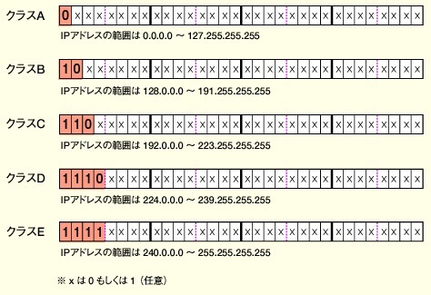

## クラス

#### ネットワーク部：ホスト部

### プライベートアドレス

|  クラス   | 範囲                                             | ネットワーク数  |
|:---------|:-------------------------------------------------|----------------|
|  クラスA  |  10.0.0.0 ~ 10.255.255.255 (10.0.0.0/8)	       |  1             |
|  クラスB  |  172.16.0.0 ~ 172.31.255.255 (172.16.0.0/12)	   |  16            |
|  クラスC  |  192.168.0.0 ~ 192.168.255.255 (192.168.0.0/16)  |  256           |

