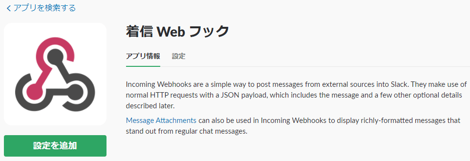

## webhookを利用した通知
incoming-webhook
<p></p>
<p></p>
<p></p>
<p></p>
<p></p>
<p></p>


### 作成例
－１－
```
{
    "text": "sample01",
    "username": "webhookbot",
    "channel": "#hooks",
    "icon_emoji": ":ghost:"
}
```
－２－
```
{
   "attachments":[
      {
         "fallback":"fallback Test",
         "pretext":"attachments Test",
         "color":"#D00000",
         "fields":[
            {
               "title":"attachment01",
               "value":"This is attachment"
            }
         ]
      }
   ]
} 
```
－３－
```
curl -X POST --data-urlencode 'payload={"text": "TEST"}' https://hooks.slack.com/services/T82araaMS7/B9UaabAAREBQDGJjpSU/dXUrEwberec87GoiSsBFqaDM
```

## Slackmojis
https://slackmojis.com/
